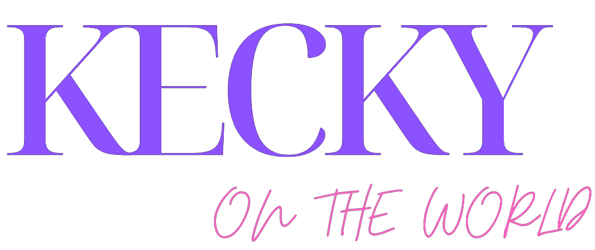

👋 Hi im KekOnTheWorld a german developer!

### Experience
- C
- C++
- C#
- Java
- HTML, CSS
- JavaScript
- TypeScript
- Python
- SQL

### Links:
- [Website](https://kotw.dev)
- [Email](mailto:kek@kotw.dev)
- [Discord](https://discord.gg/Cq2UpzeTnm)

### Goals before 2022:
- [LoafStandarts](https://github.com/KekOnTheWorld/LoafStandarts)
- [Loaf](https://github.com/KekOnTheWorld/Loaf)
- [grista](https://github.com/KekOnTheWorld/grista)

<!---
KekOnTheWorld/KekOnTheWorld is a ✨ special ✨ repository because its `README.md` (this file) appears on your GitHub profile.
You can click the Preview link to take a look at your changes.
--->
 

Image made by [Ricky](https://github.com/Rickaym)
